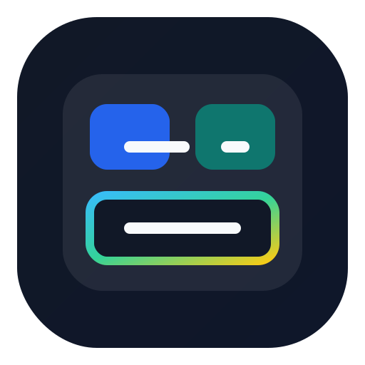

# Codex Skills Hub

<p align="center">
  
</p>

<p align="center">
  A curated landing page for reusable agent skills focused on architecture, team orchestration, design workflows, and developer tooling.
</p>

Despite the historical repository name, this hub is not limited to Codex. The featured skills are designed to be portable across Codex, OpenClaw, Claude Code, Hermes Agent, and similar tools that support `SKILL.md`-style workflows.

## Featured Skills

### 1. Harness Creator

Design safe, layered, production-ready agent harnesses.

- Repository: [harness-creator](https://github.com/Arthurescc/harness-creator)
- Best for: coding agents, CLI runtimes, tool orchestration, MCP-enabled assistants, planning/subagent systems
- Core value: turns fuzzy "build an agent" requests into concrete architecture, implementation order, and safety rules

### 2. Agent Teams Creator

Analyze and design protocol-driven agent team runtimes.

- Repository: [agent-teams-creator](https://github.com/Arthurescc/agent-teams-creator)
- Best for: coordinator/worker runtimes, task-board-driven multi-agent systems, mailbox protocols, verifier flows
- Core value: makes task board, mailbox, coordinator, and isolation boundaries explicit instead of collapsing them into vague swarm language

### 3. Stitch UI Bridge

Bridge frontend design prompts from Codex, Claude Code, or Cursor into Stitch and get raw export code back.

- Repository: [stitch-ui-bridge](https://github.com/Arthurescc/stitch-ui-bridge)
- Best for: UI prototyping, frontend design generation, Stitch browser automation, raw export handoff, privacy-safe local bridge workflows
- Core value: turns a logged-in Stitch browser session into a structured local design backend with stage-aware waiting and optional `Thinking with 3.1 Pro`

### 4. Google Design Fusion

Fuse `design.google`, `awesome-design-md`, and a local retrieval harness into a stronger front-end design workflow.

- Repository: [google-design-fusion](https://github.com/Arthurescc/google-design-fusion)
- Best for: landing pages, app shells, design-system direction, UI audits, anti-AI-slop design review
- Core value: brings retrieval-backed design judgment, style fusion, and explicit guardrails into front-end generation workflows

## Why This Hub Exists

These skills are not generic prompt snippets. They are reusable, tested skill packages designed to improve how coding agents structure analysis, design, and implementation work.

They were independently designed and developed, then refined through practical testing to improve:

- output quality
- architecture clarity
- implementation readiness
- facts-vs-inference discipline
- safety and verification depth
- frontend design iteration speed

## Quick Install

### Harness Creator

```bash
git clone https://github.com/Arthurescc/harness-creator \
  "${HOME}/.codex/skills/harness-creator"
```

### Agent Teams Creator

```bash
git clone https://github.com/Arthurescc/agent-teams-creator \
  "${HOME}/.codex/skills/agent-teams-creator"
```

### Stitch UI Bridge

```bash
git clone https://github.com/Arthurescc/stitch-ui-bridge \
  "${HOME}/.codex/skills/stitch-ui-bridge"
```

### Google Design Fusion

```bash
git clone https://github.com/Arthurescc/google-design-fusion \
  "${HOME}/.codex/skills/google-design-fusion"
```

Common skill locations:

```text
Codex:       ~/.codex/skills/<skill-name>
Claude Code: ~/.claude/skills/<skill-name>
OpenClaw:    ~/.openclaw/skills/<skill-name>
Hermes:      ~/.hermes/skills/<skill-name>
```

On Windows, replace `${HOME}` with `%USERPROFILE%`.

Restart or refresh your agent after installation so the skill list refreshes.

## Landing Page

Open [index.html](index.html) locally, or use the GitHub Pages site for a lightweight skill showcase.

## Why The Messaging Changed

Several repositories in this account started with Codex-first positioning, but the actual skill assets are broader than that. This hub now describes them as reusable agent skills so visitors understand they can apply them in other major agent tools too.

## Chinese Documentation

See [README.zh-CN.md](README.zh-CN.md).

## License

MIT
